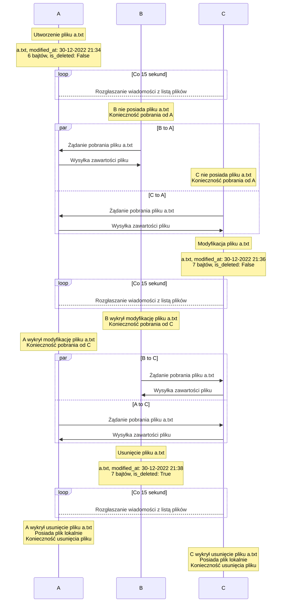
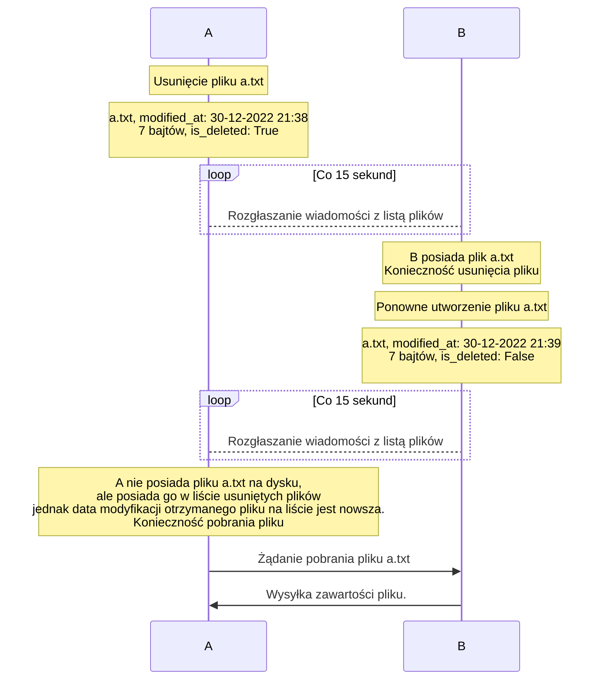

# PSI Projekt

## Synchronizacja plików z rozgłaszaniem

### Treść zadania
> 
> Stan docelowy: każdy klient utrzymuje takie same kopie plików w określonym katalogu.
> 
> Architektura peer to peer.
> 
> Każdy klient rozgłasza co pewien czas (np. 30 s) listę plików (nazwy, daty, rozmiary) z jednego katalogu. Może też dodatkowo monitorować zmiany w katalogu np. za pomocą select i natychmiast wysyłać listę plików.  Inni klienci porównują ją ze swoją listą, jeśli jest inna, żądają przesłania nieaktualnego/nowego pliku lub usuwają niepotrzebny plik. Program wypisuje na ekran log zdarzeń.
> 
> W projekcie można wykorzystać rozgłaszanie (Broadcast UDP) oraz TCP do transferu plików. Ograniczenie do sieci lokalnej (podsieć rozgłoszeniowa).
>
> Sugeruję zastosować ochronę poufności danych, np. poprzez proste szyfrowanie danych przesyłanych (np. bitowy XOR ze stringiem (stałą wartością) będącą współdzielonym sekretem (pre-shared key) połączenia dla wszystkich użytkowników). Dlaczego takie szyfrowanie jest słabe? Proszę zastanowić się, jak wygląda XOR tajnej wartości z ciągiem zer i pobawić się z XOR w https://gchq.github.io/CyberChef/
> 
> Dla uproszczenia przyjąć maksymalną liczbę klientów na 5.
> 
> W środowisku docker można podmontować katalog do kontenera za pomocą opcji –v.


### Skład zespołu
Bartłomiej Rasztabiga: Lider zespołu
Wojciech Kołodziejak
Mikołaj Olejnik
Marcin Zasuwa


### Data przekazania sprawozdania

18.01.2023


## Doprecyzowanie treści zadania

Klient odbierający - klient otrzymujący listę plików.

Klient wysyłający - klient rozgłaszający listę plików.

Każdy klient przyjmuje jako argument nazwę interfejsu sieciowego używanego do komunikacji. Program pobiera adres IP interfejsu oraz adres broadcastowy używany do rozgłaszania listy plików. Program przyjmuje jako argument ścieżkę do synchronizowanego katalogu oraz nazwę wykorzystywanego interfejsu sieciowego. Możliwe jest również dokonfigurowanie dodatkowych parametrów np. interwał skanowania systemu plików, interwał rozgłaszania listy plików czy numer portu, w pliku .env

Co X (np. 15) sekund, każdy klient rozgłasza listę plików z atrybutami: nazwa, data utworzenia, data modyfikacji, rozmiar oraz flaga - czy został usunięty (opis flagi poniżej). Zakładamy, że synchronizowane są jedynie pliki bezpośrednio znajdujące się w podanym katalogu. Nie synchronizujemy plików rekursywnie.

Każdy klient rozgłasza również listę usuniętych plików, którą przechowuje w pamięci. Jest to wykorzystywane do rozwiązywania sytuacji konfliktowych, w których np. klient A usunie plik "a.txt", a klient B rozgłosi wiadomość, że "a.txt" istnieje, co doprowadziłoby do ponownego utworzenia pliku u klienta A.

Klient, wykrywając usunięcie lokalnego pliku, dodaje go do listy usuniętych plików z datą modyfikacji równą chwili wykrycia usunięcia. Informacja ta jest dystrybuowana razem z listą lokalnych plików.

Synchronizacja plików odbywa się jedynie w podsieci lokalnej przy wykorzystaniu rozgłaszania UDP.

Jeżeli konieczne jest pobranie nowego/zmodyfikowanego pliku, klient odbierający wysyła nazwę pliku do klienta wysyłającego, a w odpowiedzi otrzymuje jego zawartość. Możliwe jest odpytanie o jeden plik naraz. Komunikacja przy transferze plików odbywa się za pomocą protokołu TCP.

Jeżeli konieczne jest usunięcie pliku, klient odbierający usuwa plik lokalny (jeżeli istnieje) oraz zapisuje informację o usuniętym pliku, w celu propagacji do innych klientów.

Aby uniknąć wyścigów i nadmiarowych komunikatów, naraz może odbywać się tylko jedna z trzech operacji:
- rozgłaszanie listy plików
- odbieranie listy plików i reagowanie na zmiany
- transfer plików

Zastosowane zostało szyfrowanie wszystkich wysyłanych danych za pomocą bitowego XORowania ze stałym kluczem, współdzielonym przez wszystkich klientów. Wymiana klucza odbywa się poza standardową komunikacją - klucze ładowane są np. ze zmiennych środowiskowych.

Każdy klient ignoruje wiadomości rozgłoszone przez siebie, filtrując je po adresie IP klienta.

Maksymalna liczba klientów wynosi 5.


## Opis funkcjonalny – “black-box”

1. Klient rozgłasza cyklicznie (np. co 15 sekund) listę swoich plików:
Wiadomość rozgłoszeniowa zawiera listę plików wraz z ich:
- nazwą
- datą utworzenia
- datą modyfikacji
- rozmiarem
- flagą, czy plik o danej nazwie został usunięty (jeżeli plik został usunięty lokalnie, to ustawiamy flagę deleted oraz zmieniamy datę modyfikacji usuniętego pliku na chwilę obecną)


2. Inni klienci odbierają listę plików, porównują ze swoją i podejmują dalsze działania:
- lista plików się zgadza (nazwy plików i daty modyfikacji są zgodne):
    - OK
- w odebranej liście pojawił się nowy plik -> konieczność pobrania
    - Klient odbierający wysyła żądanie (nazwa pliku) pobrania pliku do klienta wysyłającego
    - Klient wysyłający odsyła żądaną zawartość
    - Klient odbierający zapisuje plik w lokalnym systemie plików, kopiując oryginalne daty stworzenia i modyfikacji
    - Pobieranie plików blokuje możliwość rozgłaszania listy swoich plików oraz reagowania na otrzymane listy plików
- plik został zmodyfikowany (zmieniona data modyfikacji) -> konieczność pobrania nowej wersji pliku
    - Tak samo jak powyżej
- plik został usunięty (otrzymano wpis z flagą deleted) ->
    - Informacja o usuniętym pliku zostaje zapisana lokalnie w pamięci
    - Jeżeli istnieje lokalny plik o takiej nazwie oraz lokalny plik jest starszy niż usunięty, należy usunąć plik lokalny
    - Jeżeli lokalnie istnieje plik o tej samej nazwie, ale o dacie utworzenia/modyfikacji późniejszej niż otrzymany "usunięty" plik, to wiadomość o usunięciu pliku zostaje zignorowana. Oznacza to, że najpierw usunięto plik np. abc.txt, a później klient utworzył nowy plik o takiej samej nazwie (abc.txt)
- w odebranej liście pojawił się nieusunięty plik, który istnieje w liście usuniętych plików
    - Jeżeli data modyfikacji pliku zdalnego jest późniejsza, niż data modyfikacji pliku lokalnego, należy usunąć plik z listy usuniętych plików
    - Jest to sytuacja, w której klient utworzył nowy plik o takiej samej nazwie, jak poprzednio usunięty plik
    


## Opis stosowanych protokołów komunikacyjnych, zależności czasowe przy wymianie komunikatów, oraz postać/formaty komunikatów
Każdy z klientów ma aktywne cztery wątki:
* FileSyncClientThread - nasłuchuje na wiadomości zawierające listy plików:
    * przez cały czas nasłuchujemy ruch na Broadcast UDP na wybranym porcie, w przypadku otrzymania wiadomości zawierającej listę plików przekazujemy ją dalej w programie (który, gdy uzna, że potrzebuje pobrać listę plików, inicjuję ją z nadawcą danej listy), z racji wykorzystywanej metody musimy pamiętać o ignorowaniu własnych wiadomości, które zgodnie z założeniami UDP Broadcast zostaną otrzymane również przez nas
* FileSyncServerThread - wysyła okresowo listę plików:
    * co określony czas wysyłamy przy pomocy UDP Broadcast informację o plikach (zarówno istniejących, jak i usuniętych), dzięki temu każdy z użytkowników w danej sieci wewnętrznej otrzyma informację o obecnym stanie pliku. Z racji ograniczeń MTU dla Broadcastu, maksymalnie możemy wysłać ok. 1500 bajtów, co w przypadku większych nazw plików/ich liczby może oznaczać konieczność dzielenia wiadomości na kilka pakietów
* FileServerThread - wysyłają określony plik po otrzymaniu requestu:
    * klient A nasłuchuje na połączenia, gdy klient B się podłączy, wysyła on informację, jaki plik chce pobrać od A, po tym A zaczyna proces wysyłania pliku. Po zakończonym procesie klient A zamyka połączenie. Klient B może wysłać następne żądanie, jeśli jeszcze nie otrzymał wymaganych plików. Dzięki temu nie ma potrzeby stosowania dodatkowych nagłówków, gdyż klient B wysyła cały plik, o który poprosił A.
* FileSystemWatcherThread - śledzi zmiany w systemie plików
    * wątek ten odpowiada za okresową aktualizację metadanych plików w synchronizowanym katalogu. Oblicza on również, które pliki zostały usunięte, w porównaniu do poprzednich wyliczeń.

Przykładowa wiadomość z listą plików:
| filename                                | created_at | modified_at | size | is_deleted |
|:--------------------------------------- | ---------- | ----------- | ---- | ---------- |
| 'a.txt'                                 | 1672423147 | 1672420807  | 0    | False      |
| 'addendum_type_config.metadata.json.gz' | 1672416667 | 1668269467  | 162  | False      |
| 'to_delete.txt'                         | 1672416670 | 1668269470  | 6    | True       |


Diagram 1 obrazujący synchronizację plików bez sytuacji wyjątkowych:


Diagram 2 obrazujący rozwiązywanie konfliktów przy usuwaniu pliku:



 
## Planowany podział na moduły i strukturę komunikacji między nimi
Projekt został podzielony na następujące moduły:
* `file_system` - moduł odpowiedzialny za interakcje z systemem plików, umożliwia modyfikację i odczyt plików, również implementuje metody potrzebne do wykrywania zmian w plikach synchronizowanego katalogu. Model pliku składa się nazwy pliku, ostatniej daty modyfikacji, daty utworzenia, rozmiary oraz flagi `is_deleted` oznaczającej czy plik został usunięty. Aktualizowanie listy usuniętych plików działa na zasadzie porównywania ostatniego snapshotu listy plików (jeśli plik istniał w poprzednim snapshocie, a obecnie nie znajduje się w katalogu zostaje ustawiona flaga `is_deleted`)
* `network` - moduł odpowiedzialny za warstwą sieciową realizujące następujące funkcje: 
    * cipher - odpowiada za szyfrowanie wysyłanych wiadomości (zarówno broadcastowanej listy plików, jak i samego pliku). Korzysta z secret_key'a który jest następnie używany podczas bitowego XORa.
    * deser - zawiera implementację serializacji oraz deserializacji wiadomości wysyłanych oraz odbieranych wiadomość, informacje o każdym pliku są serializowane do postaci `<nazwa pliku>,<timestamp_daty_utworzenia>,<timestamp_ostatniej_modyfikacji>,<rozmiar_pliku>,<flaga_is_deleted>;`.
    * file_downloader - odpowiada za pobieranie pliku, używając socketu TCP
    * network - odpowiada za komunikację przy użyciu socketów, implementuje zarówno wysyłanie oraz odbieranie pliku 
* `threads` - moduł odpowiedzialny za obsługę wątków, program działa na następujących wątkach:
    * FileServerThread - wątek działający jako serwer plików. Oczekuje na wiadomości od innych klientów zawierające żądanie pobrania plików, a następnie wysyła im je
    * FileSyncClientThread - wątek realizujący synchronizację plików, po otrzymaniu informacji o plikach od innego klienta, rozpoczyna sprawdzanie poprawności lokalnych plików, w sytuacji konfliktu podejmuje odpowiednią decyzję zgodnie z algorytmem podanym powyżej
    * FileSyncServerThread - wątek odpowiadający za rozgłaszanie obecnej listy plików. Co określony czas pobiera z użyciem modułu FileSystem informację o plikach w synchronizowanym katalogu, serializuje je i następnie wysyła wiadomość jako UDP Broadcast Datagram.
    * FileSystemWatcherThread - wątek odpowiadający za aktualizację informacji o plikach. Co określony interwał przy użyciu modułu `FileSystem`, aktualizowana jest bieżąca lista plików w synchronizowanym folderze.
* `utils` - moduł zawierający stałe, implementację loggera oraz pomocnicze funkcje używane w innych modułach

W sytuacjach gdy z danej zmiennej korzysta więcej niż jeden wątek, dostęp do niej został opakowany w mutexa w celu wyeliminowania negatywnych skutków wyścigów. Plik `main.py` na podstawie konfiguracji z pliku `.env` startuje poszczególne wątki wraz z odpowiednimi opcjami. 

## Opis interfejsu użytkownika

Interfejs programu ma postać konsolowego interfejsu tekstowego. Raz uruchomiony program działa aż do momentu otrzymania sygnału SIGINT lub SIGTERM. Możliwe jest również zamknięcie programu poprzez naciśnięcie kombinacji klawiszy Ctrl+C.

W trakcie działania programu wyświetlane są informacje o aktualnym stanie programu. Są one jednakowe, jak te zapisywane do pliku z logiem: filesync.log.

### Wymagania

- Python 3.7
- pip

### Instrukcja uruchomienia

Wymagane jest zainstalowanie niezbędnych zależności:

- netifaces
- python-dotenv

Można to zrobić np. wywołując polecenie

```
pip install -r requirements.txt
```

Projekt należy uruchomić podając nazwę katalogu i interfejsu sieciowego, na którym ma działać program.:

```
python3 main.py dir_to_sync eth0
```

## Plik konfiguracyjny

```
BROADCAST_INTERVAL=15
FILE_SYSTEM_CHECK_INTERVAL=1
PORT=50500
SECRET_KEY=verylongandverysecretkey
```
Plik konfiguracyjny zaw `.env` zawiera 4 ustawienia:
- `BROADCAST_INTERVAL`: częstotliwość publikowania listy plików (w sekundach)
- `FILE_SYSTEM_CHECK_INTERVAL`: częstotliwość sprawdzania systemu plików (w sekundach). Wartość ta powinna być sporo niższa niż częstotliwość broadcastu.
- `PORT`: port używany do broadcastu (UDP) i przesyłania danych (TCP)
- `SECRET_KEY`: klucz symetryczny używany do szyfrowania rozgłaszanej listy plików i przesyłanych plików

## Format logów
Logi składają się z:
- daty
- godziny
- poziomu logów (INFO/DEBUG/ERROR)
- modułu
- wiadomości

Przykładowy log z uruchomionej aplikacji:
```
2023-01-16 20:57:42.692 INFO     FileSync           Starting FileSync
2023-01-16 20:57:42.692 DEBUG    FileSyncServer     Broadcasting 0 local files and 0 deleted files
2023-01-16 20:57:57.707 DEBUG    FileSyncServer     Broadcasting 0 local files and 0 deleted files
2023-01-16 20:58:12.724 DEBUG    FileSyncServer     Broadcasting 0 local files and 0 deleted files
2023-01-16 20:58:27.740 DEBUG    FileSyncServer     Broadcasting 0 local files and 0 deleted files
2023-01-16 20:58:42.756 DEBUG    FileSyncServer     Broadcasting 0 local files and 0 deleted files
2023-01-16 20:58:57.772 DEBUG    FileSyncServer     Broadcasting 0 local files and 0 deleted files
2023-01-16 20:59:12.789 DEBUG    FileSyncServer     Broadcasting 0 local files and 0 deleted files
2023-01-16 20:59:27.803 DEBUG    FileSyncServer     Broadcasting 0 local files and 0 deleted files
2023-01-16 20:59:42.820 DEBUG    FileSyncServer     Broadcasting 1 local files and 0 deleted files
2023-01-16 20:59:42.821 INFO     FileServer         Received download request for new_file.txt from 172.25.66.251
2023-01-16 20:59:42.822 INFO     FileServer         Received download request for new_file.txt from 172.25.75.17
2023-01-16 20:59:42.822 INFO     FileServer         Received download request for new_file.txt from 172.25.69.181
2023-01-16 20:59:48.504 DEBUG    FileSyncClient     Received 1 local files and 0 deleted files from 172.25.69.181
2023-01-16 20:59:51.848 DEBUG    FileSyncClient     Received 1 local files and 0 deleted files from 172.25.75.17
2023-01-16 20:59:53.824 DEBUG    FileSyncClient     Received 1 local files and 0 deleted files from 172.25.66.251
2023-01-16 20:59:57.836 DEBUG    FileSyncServer     Broadcasting 1 local files and 0 deleted files
2023-01-16 21:00:03.520 DEBUG    FileSyncClient     Received 1 local files and 1 deleted files from 172.25.69.181
2023-01-16 21:00:03.520 INFO     FileSyncClient     Downloading new_file.txt from 172.25.69.181, because it's modified
2023-01-16 21:00:06.864 DEBUG    FileSyncClient     Received 1 local files and 1 deleted files from 172.25.75.17
2023-01-16 21:00:08.841 DEBUG    FileSyncClient     Received 1 local files and 1 deleted files from 172.25.66.251
2023-01-16 21:00:12.852 DEBUG    FileSyncServer     Broadcasting 1 local files and 1 deleted files
2023-01-16 21:00:18.536 DEBUG    FileSyncClient     Received 1 local files and 1 deleted files from 172.25.69.181
2023-01-16 21:00:21.880 DEBUG    FileSyncClient     Received 1 local files and 1 deleted files from 172.25.75.17
2023-01-16 21:00:23.857 DEBUG    FileSyncClient     Received 1 local files and 1 deleted files from 172.25.66.251
2023-01-16 21:00:27.869 DEBUG    FileSyncServer     Broadcasting 1 local files and 1 deleted files
2023-01-16 21:00:33.552 DEBUG    FileSyncClient     Received 1 local files and 1 deleted files from 172.25.69.181
2023-01-16 21:00:36.896 DEBUG    FileSyncClient     Received 0 local files and 2 deleted files from 172.25.75.17
2023-01-16 21:00:36.896 INFO     FileSyncClient     Deleting local new_file.txt, because it is marked as deleted
2023-01-16 21:00:37.880 INFO     FileSystem         File new_file.txt is now marked as deleted
2023-01-16 21:00:38.874 DEBUG    FileSyncClient     Received 0 local files and 2 deleted files from 172.25.66.251
2023-01-16 21:00:42.885 DEBUG    FileSyncServer     Broadcasting 0 local files and 2 deleted files
2023-01-16 21:00:48.567 DEBUG    FileSyncClient     Received 0 local files and 2 deleted files from 172.25.69.181
2023-01-16 21:00:51.912 DEBUG    FileSyncClient     Received 0 local files and 2 deleted files from 172.25.75.17
2023-01-16 21:00:53.890 DEBUG    FileSyncClient     Received 0 local files and 2 deleted files from 172.25.66.251
2023-01-16 21:00:55.892 DEBUG    FileSyncClient     FileSyncClientThread stopped
2023-01-16 21:00:55.899 DEBUG    FileServer         FileServerThread stopped
2023-01-16 21:00:55.899 DEBUG    FileSyncServer     FileSyncServerThread stopped
2023-01-16 21:00:55.900 DEBUG    FileSystemWatcher  FileSystemWatcherThread stopped
2023-01-16 21:00:55.900 INFO     FileSync           FileSync stopped
```

## Opis wykorzystanych narzędzi

Wybrany język programowania: Python

Wykorzystane moduły biblioteki standardowej: os, socket, sys, threading, datetime, dataclasses, typing

Wykorzystane zewnętrzne biblioteki: netifaces (do pobierania adresu IP oraz adresu broadcastowe danego interfejsu sieciowego), python-dotenv (do ładowania konfiguracji z pliku .env)

Narzędzia: Docker

Wykorzystano własny format danych do (de)/serializacji. Kolejne pola pliku oddzielone są przecinkiem, a kolejne pliki oddzielono średnikami.

Wykorzystany został pakiet threading w celu realizacji wielowątkowości.

## Opis przypadków testowych

### Środowisko testowe

Projektu nie udało się przetestować w środowisku Dockera, ponieważ UDP broadcast nie jest wspierany w sieci typu bridge. Zastosowano maszyny wirtualne (maksymalnie 5) z systemem Ubuntu 22.04, podłączone do tej samej wirtualnej sieci.

Przykład konfiguracji interfejsu sieciowego na maszynie gościa:

```
2: eth0: <BROADCAST,MULTICAST,UP,LOWER_UP> mtu 1500 qdisc mq state UP group default qlen 1000
    link/ether 52:54:00:6b:fd:f6 brd ff:ff:ff:ff:ff:ff
    inet 172.25.69.181/20 metric 100 brd 172.25.79.255 scope global dynamic eth0
       valid_lft 66344sec preferred_lft 66344sec
    inet6 fe80::5054:ff:fe6b:fdf6/64 scope link
       valid_lft forever preferred_lft forever
```

### Przypadek standardowy
Do przypadku standardowego wykorzystaliśmy scenariusz opisany na diagramie 1

Kroki:
- [Działanie] w kliencie A dodanie pliku a.txt
- [Założenie] klient B powinien pobrać plik a.txt od klienta A
- [Założenie] klient C powinien pobrać plik a.txt od klienta A
- [Działanie] w kliencie C modyfikacja pliku a.txt
- [Założenie] klient A powinien pobrać plik a.txt od klienta C
- [Założenie] klient B powinien pobrać plik a.txt od klienta C
- [Działanie] w kliencie B usunięcie pliku a.txt
- [Założenie] klient A powinien usunąć plik a.txt
- [Założenie] klient C powinien usunąć plik a.txt
- [Założenie] finalnie w żadnym z klientów nie powinien istnieć plik a.txt

Logi z 3 klientów (A, B, C):
```
W logu zamieniono adresy IP na nazwy klientów

klient A 2023-01-16 21:39:56.985 INFO FileSync Starting FileSync
klient B 2023-01-16 21:39:57.648 INFO FileSync Starting FileSync
klient C 2023-01-16 21:39:58.136 INFO FileSync Starting FileSync

# dodano plik a.txt w kliencie A
klient B 2023-01-16 21:40:12.3   INFO FileSyncClient Downloading a.txt from klient A, because it's not in local files
klient A 2023-01-16 21:40:12.3   INFO FileServer Received download request for a.txt from klient B

klient C 2023-01-16 21:40:12.4   INFO FileSyncClient Downloading a.txt from klient A, because it's not in local files
klient A 2023-01-16 21:40:12.4   INFO FileServer Received download request for a.txt from klient C

# zmodyfikowano plik a.txt w kliencie C
klient A 2023-01-16 21:40:28.170 INFO FileSyncClient Downloading a.txt from klient C, because it's modified
klient C 2023-01-16 21:40:28.171 INFO FileServer Received download request for a.txt from klient A

klient B 2023-01-16 21:40:28.171 INFO FileSyncClient Downloading a.txt from klient C, because it's modified
klient C 2023-01-16 21:40:28.171 INFO FileServer Received download request for a.txt from klient B

# usunieto plik a.txt w kliencie B
klient B 2023-01-16 21:40:38.694 INFO FileSystem File a.txt is now marked as deleted
klient A 2023-01-16 21:40:42.696 INFO FileSyncClient Deleting local a.txt, because it is marked as deleted
klient C 2023-01-16 21:40:42.696 INFO FileSyncClient Deleting local a.txt, because it is marked as deleted
klient A 2023-01-16 21:40:43.36  INFO FileSystem File a.txt is now marked as deleted
klient C 2023-01-16 21:40:43.186 INFO FileSystem File a.txt is now marked as deleted

klient A 2023-01-16 21:41:01.207 INFO FileSync FileSync stopped
klient B 2023-01-16 21:41:02.209 INFO FileSync FileSync stopped
```

Aplikacja zadziałała zgodnie z oczekiwaniami. Finalnie we wszystkich klientach plik a.txt został usunięty.


### Przypadek z rozwiązaniem konfliktu nazw przy usuwaniu plików

Do przypadku z rozwiązaniem konfliktu nazw przy usuwaniu plików wykorzystaliśmy scenariusz opisany na diagramie 2

Kroki:
- [Sytuacja początkowa] W klientach A i B istnieje jednakowy plik a.txt
- [Działanie] w kliencie A usunięcie pliku a.txt
- [Założenie] klient B powinien usunąć plik a.txt
- [Działanie] w kliencie B dodanie pliku a.txt
- [Założenie] klient A powinien pobrać plik a.txt od klienta B
- [Założenie] finalnie w obu klientach powinien istnieć plik a.txt

Logi z 2 klientów (A, B):

```
W logu zamieniono adresy IP na nazwy klientów

klient A 2023-01-16 22:01:54.208 INFO     FileSync           Starting FileSync
klient B 2023-01-16 22:01:55.803 INFO     FileSync           Starting FileSync

# usunięto plik a.txt w kliencie A
klient A 2023-01-16 22:02:02.218 INFO     FileSystem         File a.txt is now marked as deleted
klient B 2023-01-16 22:02:09.227 INFO     FileSyncClient     Deleting local a.txt, because it is marked as deleted
klient B 2023-01-16 22:02:09.819 INFO     FileSystem         File a.txt is now marked as deleted

# dodano plik a.txt w kliencie B
klient B 2023-01-16 22:02:24.835 INFO     FileSystem         File a.txt is no longer marked as deleted
klient A 2023-01-16 22:02:25.836 INFO     FileSyncClient     Removing a.txt from deleted files. Downloading it from klient B
klient B 2023-01-16 22:02:25.838 INFO     FileServer         Received download request for a.txt from klient A

klient B 2023-01-16 22:02:31.844 INFO     FileSync           FileSync stopped
klient A 2023-01-16 22:02:32.250 INFO     FileSync           FileSync stopped
```

Aplikacja zadziałała zgodnie z oczekiwaniami. Finalnie we wszystkich klientach plik a.txt istnieje.


### Różne klucze symetryczne

Postanowiliśmy przeprowadzić próbę, co by się stało, gdyby do szyfrowania i odszyfrowania i użyć innych kluczy.
Przy teście z wykorzystaniem kilku klientów o różnych kluczach symetrycznych znaleźliśmy defekt w naszej aplikacji, polegający na próbie deserializacji otrzymanych danych, mimo oczywistej niezgodności z obsługiwanym formatem.

Został on naprawiony i aplikacja rzuca teraz wyjątek z informacją o problemie z deserializacją paczki danych. Nie jest to jednak sytuacja krytyczna i program kontynuuje pracę po obsłużeniu wyjątku. Błędnie zdeserializowane dane są ignorowane, tak jakby klient wysłał pustą listę plików.


### Zbyt duża liczba plików

Z powodu, że nasza aplikacja wykorzystuje protokół UDP, zbyt duża liczba plików spowoduje przekroczenie maksymalnego rozmiaru pakietu. Otrzymamy wtedy komunikat wyjątku BroadcastingFailed

```
2023-01-16 20:32:21.659 ERROR    FileSyncServer     Broadcasting failed: [Errno 90] Message too long, message length: 65561
```

Aby rozwiązać ten problem należałoby zaimplementować własny protokół komunikacji, który pozwoliłby na wysyłanie pofragmentowanych pakietów, które byłyby następnie łączone w całość po stronie odbiorcy.


## Obsługa sytuacji wyjątkowych i reakcji na błędy

W przypadku wystąpienia błędu związanego z komunikacją przez sieć lub związanego z odczytem lub zapisem plików, aplikacja rzuca wyjątek z odpowiednią informacją, który jest obsługiwany przez warstwę wyżej, która to loguje informację o błędzie i kontynuuje pracę. We wszystkich wspieranych przypadkach obsługi błędu kontynuacja pracy jest możliwa.
